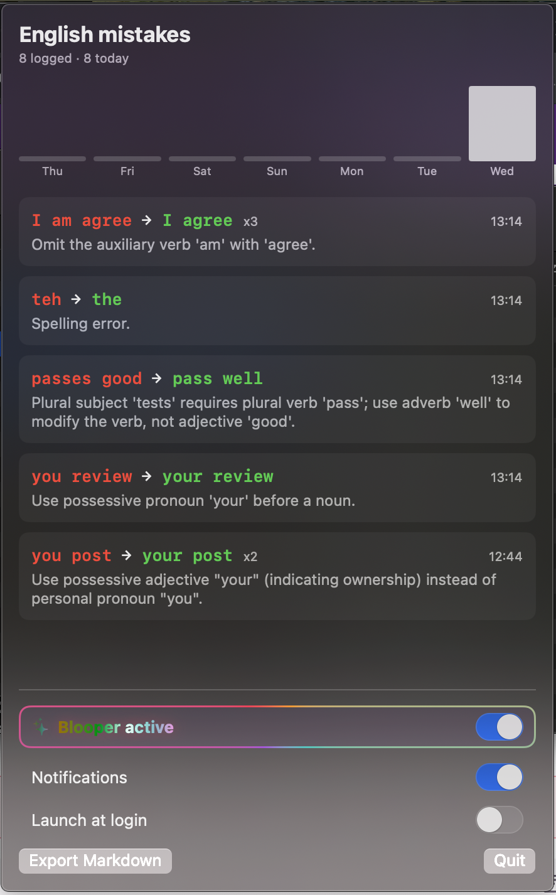
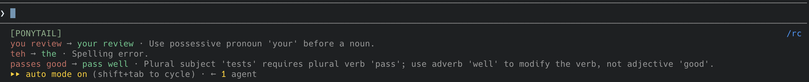
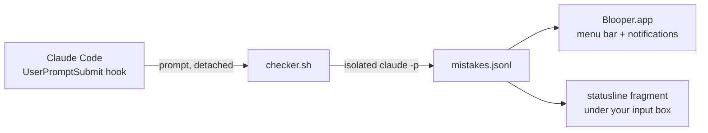

<div align="center">


# Blooper

**Catch your English mistakes while chatting with Claude Code — right in your menu bar.**

*Your session is never blocked. Your data never leaves your machine.*

[](../../releases/latest)
[](#requirements)
[](LICENSE)



</div>

---

## Why Blooper?

You write English prompts all day — but nobody tells you when you slip. Blooper does, without getting in your way:

- 🎯 **Catches mistakes as you type.** Every prompt you send to Claude Code is checked in the background. `I am agree` → `I agree`, with the grammar rule explained.
- 📊 **Shows your patterns.** Repeated mistakes get counted (`x3`), a weekly chart shows your progress, and the full history exports to Markdown.
- ⚡ **Never slows you down.** The check runs fully detached from your session — even if everything fails, your Claude conversation doesn't notice.
- 🔒 **Your subscription, your data.** Checks run through your own `claude` CLI. Nothing is sent anywhere else, nothing is persisted by Claude Code.

Corrections show up right where you work — under the Claude Code input box, next to your existing statusline:



<!-- TODO: docs/assets/demo.gif — type a faulty prompt → notification → popover -->

## Quick Start

1. Download the latest `Blooper-x.y.z.dmg` from [Releases](../../releases/latest) and drag **Blooper** to **Applications**.
2. Launch Blooper and click the menu bar icon → turn on **Blooper active**. That's it — it installs both the Claude Code hook and the statusline for you.
3. Write English prompts in Claude Code. Mistakes appear in the menu bar, as notifications, and right under your input box.

<details>
<summary><b>First launch on an unsigned app</b> (one-time step)</summary>

Blooper is open source and currently unsigned, so macOS asks for confirmation once:

- **macOS 15+:** open the app once, then System Settings → Privacy & Security → **Open Anyway**.
- **macOS 14:** right-click `Blooper.app` → **Open**.
- Terminal alternative: `xattr -d com.apple.quarantine /Applications/Blooper.app`

</details>

## Features

| | |
|---|---|
| **Menu bar dashboard** | Today's count in the menu bar; corrections, rules, repeat counts and a 7-day chart in the popover. |
| **Statusline integration** | This session's recent mistakes render under the Claude Code input box (refreshes every 20s). Already have a statusline? Blooper wraps it — your line renders first, and turning Blooper off restores your setup exactly. |
| **Session-scoped** | Two Claude windows open? Each statusline shows only its own session's mistakes. |
| **Native notifications** | Optional banner the moment a mistake is caught. |
| **Markdown export** | Full history as a table — drop it into Obsidian or anywhere else. |
| **Fail-open by design** | No `claude` CLI, not logged in, timeout, malformed output — every failure path exits silently. Your session is never held up. |

## Privacy & Cost

- Checks use **your** Claude subscription via `claude -p` (default model: `claude-haiku-4-5` — typically a fraction of a cent per prompt, up to a few cents depending on model and caching). Change the model in `~/Library/Application Support/Blooper/config.json`.
- Mistake fragments from your prompts are stored as plain text in `~/Library/Application Support/Blooper/mistakes.jsonl`, on your machine only.
- Check sessions run fully isolated: no MCP servers, no project context, no hooks, no session persistence.
- Non-English prompts, slash commands and code-heavy text are filtered out **before** any API call.

## FAQ

<details>
<summary><b>Does it slow down my Claude session?</b></summary>

No. The hook hands your prompt to a fully detached background process and returns in milliseconds. The check itself (a few seconds) happens in parallel with Claude's reply — and every failure path exits silently.

</details>

<details>
<summary><b>I already have a custom statusline. Will Blooper break it?</b></summary>

No. Blooper wraps your existing statusline: your output renders first, mistakes appear under it. Turning Blooper off restores your original configuration exactly (a backup of `settings.json` is also kept). If you change your own statusline later, toggle Blooper off and on so it wraps the new one. Power users can skip the wrapper and add one line to their own script instead:

```bash
printf '%s' "$payload" | "$HOME/Library/Application Support/Blooper/bin/statusline-fragment.sh"
```

</details>

<details>
<summary><b>Why don't mistakes show up instantly in the statusline?</b></summary>

Checks take a few seconds, and Claude Code refreshes the statusline on events and on a timer (Blooper sets a 20s refresh when it can). Expect corrections to appear within ~20 seconds of your prompt, or on your next interaction.

</details>

<details>
<summary><b>What exactly gets flagged?</b></summary>

Only real English language errors — grammar, word choice, spelling. No style advice, no rewriting suggestions. Non-English text returns nothing.

</details>

<details>
<summary><b>How does it work under the hood?</b></summary>



A `UserPromptSubmit` hook hands your prompt to a fully detached script. The script runs an isolated, tool-less `claude -p` call and appends any mistakes to a local JSONL file. The app watches that file; the statusline fragment reads it per session.

</details>

## Requirements

- macOS 14+ (Apple Silicon or Intel)
- [Claude Code](https://claude.com/claude-code) installed and logged in

## Uninstall

1. Menu bar icon → turn off **Blooper active** (removes the hook and restores your statusline; a backup is kept as `settings.json.blooper-backup`).
2. Delete `/Applications/Blooper.app` and `~/Library/Application Support/Blooper`.

If you deleted the app first: remove the Blooper entry from `hooks.UserPromptSubmit` in `~/.claude/settings.json` manually.

## Build from source

```bash
swift build            # development build
swift test             # unit tests
tests/scripts/run.sh   # shell script tests (no real API calls)
scripts/bundle.sh      # build/Blooper.app (universal)
```

## License

MIT
